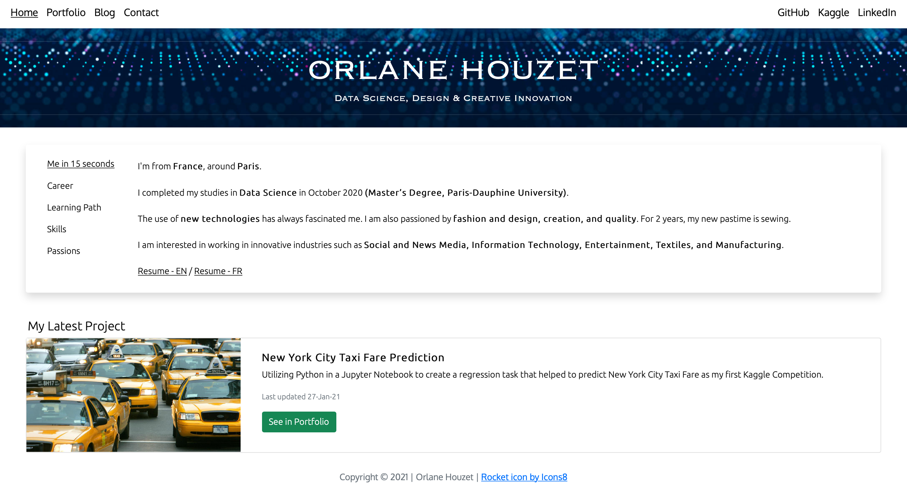

# Website
> Building a portfolio website from scratch to showcase my data science projects. 

🔗 https://www.orlanehouzet.com 🔗

I was guided by this Medium blog post: 
[How to Build a Data Science Portfolio Website](https://towardsdatascience.com/how-to-build-a-data-science-portfolio-website-335b0f253822) by Julia Nikulski.

## Development setup

Technologies and concepts I used:
HTML5 - CSS - Bootstrap v5.0 - JavaScript - Flask - Jinja - Heroku

## Release History

* 0.0.2
    * The first proper release
* 0.0.1
    * Work in progress

## Meta

Orlane Houzet - [Linkedin](https://www.linkedin.com/in/orlane-houzet/) - [Medium](https://medium.com/@orlane.houzet) - orlanehouzetdata@gmail.com

Distributed under the MIT license. See ``MIT`` for more information.

https://github.com/orlanehz
